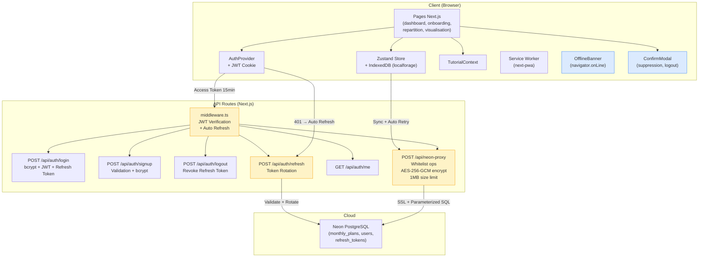

# 💰 Moneto - Gestion Financière par Enveloppes

Application web moderne de gestion financière personnelle basée sur la **méthode des enveloppes budgétaires**. Créez vos plans mensuels, répartissez vos revenus dans des enveloppes et suivez vos dépenses en temps réel.

> ⚠️ **Application en phase de test** - Des mises à jour fréquentes peuvent entraîner la suppression des données. Pensez à exporter régulièrement vos plans.

## ✨ Fonctionnalités principales

### 📊 Gestion des plans mensuels
- Création de plans mensuels avec revenus fixes et dépenses fixes
- Copie de plans existants pour gagner du temps
- Import/export de plans au format JSON
- Visualisation du solde final et de l'argent disponible

### 💼 Système d'enveloppes budgétaires
- Répartition de l'argent disponible dans des enveloppes personnalisées
- Suivi des dépenses par enveloppe en temps réel
- Allocation flexible avec pourcentages ou montants fixes
- Visualisation des soldes restants par enveloppe

### 📈 Visualisations interactives
- **Diagramme Sankey** : flux d'argent de vos revenus vers vos enveloppes
- **Diagramme Waterfall** : évolution de votre solde au fil du mois
- Graphiques Recharts pour l'analyse des dépenses
- Interface responsive optimisée mobile et desktop

### 🎓 Tutoriel interactif guidé
- Modal de bienvenue pour les nouveaux utilisateurs
- Tutoriel pas-à-pas avec données d'exemple
- Bandeau mobile avec minimisation (bulle flottante)
- Navigation au clavier (flèches, Entrée, Échap)
- Surlignage des éléments importants

### 🌓 Interface moderne
- Mode sombre/clair avec persistance
- Progressive Web App (PWA) - installable sur mobile
- Navigation adaptative (drawer mobile, sidebar desktop)
- Animations fluides avec Framer Motion

### 🐛 Signalement de bugs
- Formulaire intégré via Formspree
- Envoi de captures d'écran et descriptions
- Suivi des problèmes rapportés

## 🚀 Technologies utilisées

### Core
- **Next.js 15.5.4** - Framework React avec App Router
- **React 19.1.1** - Bibliothèque UI
- **TypeScript 5.9.2** - Typage statique strict
- **Tailwind CSS 4.1.13** - Framework CSS utilitaire

### State & Storage
- **Zustand 5.0.8** - Gestion d'état légère et performante
- **localforage 1.10.0** - Stockage persistant IndexedDB

### Visualisation
- **Recharts 3.2.1** - Bibliothèque de graphiques React
- **d3-sankey 0.12.3** - Diagrammes de flux Sankey
- **Framer Motion 12.0.1** - Animations

### Utilitaires
- **dayjs 1.11.18** - Manipulation de dates légère
- **next-pwa 5.6.0** - Configuration PWA
- **next-themes 0.4.6** - Gestion du thème dark/light

## 📁 Structure du projet

```
├── app/                          # Pages Next.js (App Router)
│   ├── layout.tsx               # Layout racine avec providers
│   ├── layout-with-nav.tsx      # Layout avec navigation (padding dynamique)
│   ├── page.tsx                 # Page d'accueil / landing
│   ├── dashboard/               # Dashboard - liste des plans mensuels
│   ├── onboarding/              # Création de plan (revenus/dépenses fixes)
│   ├── repartition/             # Répartition en enveloppes
│   ├── visualisation/           # Graphiques et visualisations
│   ├── report-bug/              # Formulaire de signalement de bugs
│   └── globals.css              # Styles globaux + Tailwind
│
├── components/                   # Composants React réutilisables
│   ├── Navigation.tsx           # Sidebar desktop
│   ├── MobileNav.tsx            # Header + drawer mobile
│   ├── ThemeProvider.tsx        # Provider pour le thème
│   ├── ThemeToggle.tsx          # Bouton dark/light
│   ├── SankeyChart.tsx          # Diagramme Sankey (flux)
│   ├── WaterfallChart.tsx       # Diagramme Waterfall (évolution)
│   ├── IncomeExpenseForm.tsx    # Formulaire revenus/dépenses
│   └── tutorial/                # Composants du tutoriel
│       ├── TutorialBanner.tsx   # Bandeau mobile avec minimisation
│       ├── TutorialOverlay.tsx  # Overlay du tutoriel
│       ├── TutorialWelcomeModal.tsx
│       ├── TutorialHighlight.tsx
│       └── TutorialProgressBar.tsx
│
├── context/                      # Contexts React
│   └── TutorialContext.tsx      # État global du tutoriel
│
├── hooks/                        # Custom hooks
│   └── useTutorial.ts           # Hook de gestion du tutoriel
│
├── lib/                          # Utilitaires et helpers
│   ├── storage.ts               # Gestion du stockage IndexedDB
│   ├── financial.ts             # Fonctions de calculs financiers
│   ├── monthly-plan.ts          # Logique des plans mensuels
│   ├── export-import.ts         # Import/export JSON
│   ├── tutorial-data.ts         # Données et étapes du tutoriel
│   └── utils.ts                 # Utilitaires généraux
│
├── store/                        # Store Zustand
│   └── index.ts                 # Store principal avec persistance
│
├── public/                       # Assets statiques
│   ├── icons/                   # Icônes PWA
│   ├── manifest.json            # Manifest PWA
│   └── sw.js                    # Service Worker
│
├── tailwind.config.ts            # Configuration Tailwind CSS
├── tsconfig.json                 # Configuration TypeScript
├── next.config.ts                # Configuration Next.js + PWA
└── eslint.config.mjs             # Configuration ESLint
```

## 🛠️ Installation et démarrage

### Prérequis
- Node.js 18+
- npm ou yarn

### Installation

1. **Cloner le projet** :
```bash
git clone <repository-url>
cd "Test moneto web app"
```

2. **Installer les dépendances** :
```bash
npm install
```

3. **Lancer le serveur de développement** :
```bash
npm run dev
```

4. **Ouvrir le navigateur** :
Aller sur [http://localhost:3000](http://localhost:3000)

### Scripts disponibles

```bash
npm run dev      # Lance le serveur de développement
npm run build    # Compile l'application pour la production
npm run start    # Lance le serveur de production
npm run lint     # Vérifie le code avec ESLint
```

## 📖 Guide d'utilisation

### 1. Créer un plan mensuel

Depuis le **Dashboard**, cliquez sur "Créer un nouveau plan" :
- Définissez vos revenus fixes (salaire, allocations...)
- Ajoutez vos dépenses fixes récurrentes (loyer, abonnements...)
- Le solde disponible est calculé automatiquement

### 2. Répartir en enveloppes

Dans la page **Répartition** :
- Créez des enveloppes pour vos catégories de dépenses
- Allouez un montant ou un pourcentage à chaque enveloppe
- Le système vérifie que vous ne dépassez pas votre budget disponible

### 3. Suivre les dépenses

- Ajoutez vos dépenses réelles dans chaque enveloppe
- Visualisez vos soldes restants en temps réel
- Consultez les graphiques dans **Visualisation**

### 4. Exporter / Importer

- **Exporter** : sauvegardez vos plans en JSON
- **Importer** : restaurez vos données après une mise à jour
- **Copier** : dupliquez un plan existant pour le mois suivant

## 🎨 Fonctionnalités techniques

### Store Zustand avec persistance

Le store (`store/index.ts`) gère :
- **Plans mensuels** : création, modification, suppression, copie
- **Enveloppes** : allocation budgétaire et suivi des dépenses
- **Paramètres utilisateur** : préférences, tutoriel vu/complété
- **Persistance automatique** : sauvegarde dans IndexedDB via localforage
- **Réhydratation** : restauration de l'état au chargement

### Tutoriel interactif

Système complet avec :
- **TutorialContext** : état global (étape, bandeau étendu/réduit)
- **Navigation automatique** : changement de page selon l'étape
- **Bandeau mobile** : minimisable avec bulle flottante en bas à gauche
- **Padding dynamique** : ajustement du scroll selon l'état du bandeau
- **Plan d'exemple** : données pré-remplies pour la démo

### Responsive Design

- **Mobile-first** : optimisé pour les petits écrans
- **Breakpoints** : adaptation desktop avec sidebar fixe
- **Touch-friendly** : zones de clic de 44px minimum
- **Scroll fluide** : padding-bottom dynamique pour éviter les blocages

### Progressive Web App (PWA)

Configuration complète :
- **Manifest** : icônes, couleurs, mode standalone
- **Service Worker** : mise en cache des assets
- **Installable** : ajout à l'écran d'accueil mobile
- **Offline** : fonctionnement partiel hors ligne

## 🎨 Thème et personnalisation

### Mode sombre

- Activation via `ThemeToggle` dans la navigation
- Persistance dans localStorage
- Variables CSS adaptatives
- Couleurs optimisées pour la lisibilité

### Couleurs principales

```css
--emerald-500: #10b981  /* Action principale */
--blue-600: #2563eb     /* Liens et accents */
--red-500: #ef4444      /* Dépenses et alertes */
--slate-800: #1e293b    /* Fond sombre */
```

## 📦 Dépendances principales

| Package | Version | Usage |
|---------|---------|-------|
| next | ^15.5.4 | Framework React + SSR |
| react | ^19.1.1 | Bibliothèque UI |
| typescript | ^5.9.2 | Typage statique |
| zustand | ^5.0.8 | Gestion d'état globale |
| localforage | ^1.10.0 | Stockage IndexedDB |
| recharts | ^3.2.1 | Graphiques interactifs |
| d3-sankey | ^0.12.3 | Diagrammes Sankey |
| framer-motion | ^12.0.1 | Animations fluides |
| next-pwa | ^5.6.0 | Configuration PWA |
| next-themes | ^0.4.6 | Gestion dark/light |
| tailwindcss | ^4.1.13 | Framework CSS |
| dayjs | ^1.11.18 | Manipulation de dates |

## 🔧 Configuration

### TypeScript

Configuration stricte avec :
- Mode strict activé
- Alias de chemins (`@/*` → racine)
- Support JSX/TSX
- Cible ES2020

### Tailwind CSS

Personnalisations :
- Mode sombre avec classe `dark:`
- Breakpoints responsive
- Animations personnalisées
- Couleurs étendues

### Next.js

Optimisations :
- App Router (nouvelles conventions)
- PWA avec next-pwa
- Images optimisées
- Compilation incrémentale

## 🐛 Problèmes connus

- **Phase de test** : données peuvent être perdues lors des mises à jour
- **Solution** : exporter régulièrement vos plans en JSON

## 🚀 Roadmap

- [ ] Synchronisation cloud (optionnelle)
- [ ] Récurrence de dépenses variables
- [ ] Statistiques avancées (graphiques mensuels/annuels)
- [ ] Catégories personnalisables avec icônes
- [ ] Export PDF des rapports
- [ ] Mode multi-comptes (partage de budget)

## Architecture (Mermaid)



## Security Headers

L'application configure les headers de securite suivants en production :
- `X-Frame-Options: DENY` - Protection clickjacking
- `X-Content-Type-Options: nosniff` - Prevention MIME sniffing
- `Strict-Transport-Security` - Force HTTPS
- `Referrer-Policy: strict-origin-when-cross-origin`
- `Permissions-Policy` - Desactive camera, micro, geolocation
- `Content-Security-Policy` - Protection XSS (self + domaines autorises)

## 📄 License

ISC

---

**Developpe avec soin pour une gestion budgetaire simplifiee**
